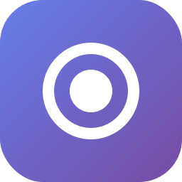

# Ooze

<div align="center">



**Красивое desktop приложение для управления Zapret DPI bypass**

[](https://opensource.org/licenses/MIT)
[](https://www.microsoft.com/windows)
[](https://www.electronjs.org/)
[](https://reactjs.org/)

[Скачать](https://github.com/samslader/ooze/releases) • [Документация](#-возможности) • [Сборка](#-сборка)

</div>

---

## 📖 О проекте

**Ooze** — это современное графическое приложение для управления [Zapret](https://github.com/bol-van/zapret), инструментом обхода DPI (Deep Packet Inspection). Вместо запуска через командную строку и .bat файлы, Ooze предоставляет красивый интерфейс в стиле **Liquid Glass** с полной функциональностью управления.

### ✨ Почему Ooze?

- 🎨 **Liquid Glass дизайн** — современный интерфейс с полупрозрачными элементами, размытием и анимациями
- 🚀 **Простота использования** — никаких .bat файлов, всё в одном окне
- ⚙️ **17 готовых конфигураций** — от General до ALT11, FAKE TLS, Simple Fake
- 🔍 **Встроенная диагностика** — проверка системы и полное тестирование всех конфигов
- 🔄 **Автообновления** — получайте новые версии автоматически через GitHub Releases
- 🇷🇺 **Полностью на русском** — весь интерфейс переведён

---

## 🎯 Возможности

### Управление сервисом
- ▶️ Запуск/остановка DPI bypass одной кнопкой
- 🔧 Установка/удаление Windows-сервиса
- 📊 Мониторинг статуса в реальном времени
- 🏷️ Отображение текущей конфигурации

### Конфигурации
17 предустановленных стратегий обхода:
- **General** (рекомендуется) — стандартная конфигурация для Discord и YouTube
- **ALT, ALT2-11** — альтернативные методы с разными параметрами
- **Fake TLS Auto** — автоматическое определение
- **Simple Fake** — простая инъекция пакетов

### Настройки
- 🎮 **Game Filter** — расширенный диапазон портов (1024-65535) для игр
- 🗂️ **IPSet Mode** — управление фильтрацией IP (Any/Loaded/None)

### Диагностика
- ⚡ **Быстрая проверка** — Base Filtering Engine, TCP Timestamps, конфликты
- 🧪 **Полный тест** — тестирование всех конфигов с проверкой доступности сервисов
  - HTTP/TLS1.2/TLS1.3/Ping тесты
  - Проверка DPI блокировок (TCP 16-20KB freeze)
  - Результаты сохраняются в `zapret/utils/test results/`

---

## 📸 Скриншоты

<div align="center">

### Главный экран


### Диагностика


</div>

---

## 🚀 Быстрый старт

### Требования
- Windows 10/11
- Node.js 18+ (только для разработки)
- Права администратора (для установки сервиса)

### Установка

1. Скачайте последнюю версию из [Releases](https://github.com/samslader/ooze/releases)
2. Запустите установщик `Ooze-Setup-x.x.x.exe`
3. Следуйте инструкциям установщика
4. Запустите Ooze от имени администратора

### Первый запуск

1. Выберите конфигурацию (рекомендуется **General**)
2. Нажмите **"Запустить"**
3. Проверьте статус — должно быть "Сервис запущен"
4. Готово! DPI обход активен

---

## 🛠️ Сборка

### Подготовка

1. Клонируйте репозиторий:
```bash
git clone https://github.com/samslader/ooze.git
cd ooze
```

2. Установите зависимости:
```bash
npm install
```

3. Убедитесь, что папка `zapret/` содержит:
   - `zapret/bin/winws.exe` и драйверы
   - `zapret/lists/*.txt` — списки доменов

### Разработка

Запустите в режиме разработки:

```bash
# Терминал 1: Запустите Vite (React)
npm run dev

# Терминал 2: Запустите Electron
npm run electron:dev
```

Приложение откроется автоматически. Изменения в React применяются мгновенно (hot reload).

### Сборка для продакшена

Создайте установщик:

```bash
npm run package
```

Готовый установщик будет в папке `release/`:
- `Ooze Setup x.x.x.exe` — установщик NSIS

### Структура проекта

```
ooze/
├── src/
│   ├── main/                    # Electron main process
│   │   ├── main.ts              # Точка входа
│   │   ├── preload.ts           # Preload скрипт
│   │   └── services/            # Сервисы управления
│   ├── renderer/                # React UI
│   │   ├── App.tsx              # Главный компонент
│   │   ├── components/          # UI компоненты
│   │   └── styles/              # CSS стили
│   └── shared/                  # Общие типы
├── configs/                     # JSON конфигурации (17 шт)
├── zapret/                      # Zapret файлы
│   ├── bin/                     # winws.exe и драйверы
│   └── lists/                   # Списки доменов
├── assets/                      # Иконки
└── electron-builder.json        # Настройки сборки
```

---

## 🔧 Технологии

- **[Electron](https://www.electronjs.org/)** — Desktop framework
- **[React](https://reactjs.org/)** — UI библиотека
- **[TypeScript](https://www.typescriptlang.org/)** — Типизация
- **[Fluent UI 2](https://react.fluentui.dev/)** — Компоненты Microsoft
- **[Vite](https://vitejs.dev/)** — Быстрый сборщик
- **[electron-builder](https://www.electron.build/)** — Создание установщика
- **[electron-updater](https://www.electron.build/auto-update)** — Автообновления

---

## 📝 Конфигурация

Все конфигурации хранятся в `configs/` как JSON файлы. Пример структуры:

```json
{
  "name": "general",
  "displayName": "General (Рекомендуется)",
  "description": "Стандартная конфигурация для Discord и YouTube",
  "rules": [
    {
      "filterTcp": "443",
      "hostlist": "list-general.txt",
      "dpiDesync": "multisplit",
      "dpiDesyncRepeats": 6
    }
  ]
}
```

### Добавление своей конфигурации

1. Создайте файл `configs/my-config.json`
2. Добавьте опцию в `src/renderer/components/ConfigSelector.tsx`
3. Пересоберите приложение

---

## 🔄 Автообновления

Приложение автоматически проверяет обновления через GitHub Releases.

### Настройка для своего репозитория

1. Отредактируйте `electron-builder.json`:
```json
"publish": {
  "provider": "github",
  "owner": "samslader",
  "repo": "ooze"
}
```

2. Создайте новый релиз на GitHub
3. Загрузите `.exe` файл из `release/`
4. Пользователи получат уведомление об обновлении

---

## 🐛 Решение проблем

### Приложение не запускается
- Запустите от имени администратора
- Проверьте, что все файлы zapret на месте
- Посмотрите логи в консоли разработчика (Ctrl+Shift+I)

### Сервис не устанавливается
- Убедитесь, что нет конфликтующих сервисов (GoodbyeDPI)
- Запустите диагностику в приложении
- Проверьте права администратора

### Обход не работает
- Попробуйте другую конфигурацию (ALT, ALT2)
- Запустите "Полный тест конфигов"
- Проверьте, что TCP Timestamps включены
- Очистите кэш Discord/браузера

---

## 🤝 Вклад в проект

Мы приветствуем вклад в развитие проекта!

1. Fork репозитория
2. Создайте ветку для фичи (`git checkout -b feature/amazing-feature`)
3. Commit изменения (`git commit -m 'Add amazing feature'`)
4. Push в ветку (`git push origin feature/amazing-feature`)
5. Откройте Pull Request

---

## 📄 Лицензия

Этот проект распространяется под лицензией MIT. См. файл [LICENSE](LICENSE) для подробностей.

---

## 🙏 Благодарности

- [Zapret](https://github.com/bol-van/zapret) — Основной инструмент обхода DPI
- [Fluent UI](https://react.fluentui.dev/) — UI компоненты Microsoft
- [Electron](https://www.electronjs.org/) — Desktop framework
- Сообщество за тестирование и обратную связь

---

## 📞 Контакты

- GitHub: [@samslader](https://github.com/samslader)
- Issues: [github.com/samslader/ooze/issues](https://github.com/samslader/ooze/issues)

---

<div align="center">

**Сделано с ❤️ для свободного интернета**

⭐ Поставьте звезду, если проект вам помог!

</div>
